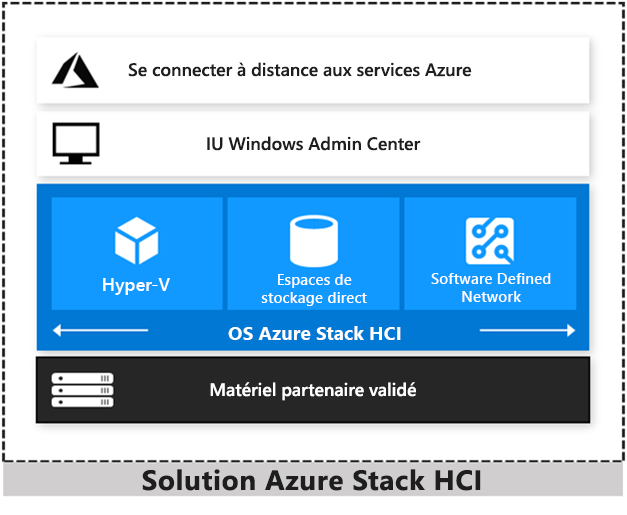

# Vue d’ensemble des solutions Azure Stack HCI

Azure Stack HCI est un cluster Windows Server 2019 hyperconvergé qui utilise du matériel validé pour exécuter localement des charges de travail virtualisées. Vous pouvez aussi vous connecter aux services Azure à des fins de sauvegarde dans le cloud, récupération de site, etc. Les solutions Azure Stack HCI utilisent le matériel validé par Microsoft pour garantir des performances et une fiabilité optimales. Les solutions incluent la prise en charge de technologies telles que les lecteurs NVMe, la mémoire persistante et les réseaux d’accès direct à la mémoire à distance (RDMA).

Azure Stack HCI est une solution qui combine plusieurs produits :

- Matériel d’un partenaire OEM
- Windows Server 2019 Datacenter Edition
- Windows Admin Center
- Services Azure (facultatifs)

Azure Stack HCI est une solution hyperconvergée de Microsoft disponible auprès d’un large éventail de partenaires fournisseurs de matériel. Examinez les scénarios suivants pour déterminer si la solution hyperconvergée Azure Stack HCI est celle qui répond le mieux à vos besoins :

- **Actualisez du matériel vieillissant.** Remplacez les serveurs les plus anciens et l’infrastructure de stockage pour exécuter des machines virtuelles Windows et Linux localement et en périphérie avec des outils et qualifications informatiques existantes.

- **Consolidez des charges de travail virtualisées.** Consolidez des applications héritées sur une infrastructure efficace et hyperconvergée. Exploitez les mêmes types d’efficacité de cloud que ceux utilisés pour exécuter des centres de données hyperscale comme Microsoft Azure.

- **Connectez-vous à Azure pour bénéficier de services cloud hybride.** Rationalisez l’accès aux services de gestion et de sécurité cloud dans Azure, notamment à la sauvegarde hors site, à la récupération de site, à la supervision cloud, etc.

## La famille Azure Stack

Azure Stack HCI fait partie de la famille Azure et Azure Stack, et utilise les mêmes logiciels de calcul, de stockage et de réseau à définition logicielle qu’Azure Stack Hub. Vous trouverez ci-dessous un rapide résumé des différentes solutions. Pour plus d’informations, consultez [Comparaison de l’écosystème Azure Stack](../operator/compare-azure-azure-stack.md).

- [Azure](https://azure.microsoft.com) - Utilisez les services de cloud public pour migrer des ressources de calcul à la demande et en libre-service, moderniser des applications existantes et générer de nouvelles applications cloud natives.
- [Azure Stack Edge](https://docs.microsoft.com/azure/databox-online/data-box-edge-overview)- Accélérez les charges de travail Machine Learning et exécutez des applications en conteneur ou des charges de travail virtualisées en local, sur une appliance gérée par le cloud.
- [Azure Stack HCI](https://azure.microsoft.com/overview/azure-stack/hci) - Exécutez des applications virtualisées localement, remplacez et consolidez une infrastructure de serveur vieillissante et connectez-vous à Azure pour les services cloud.
- [Azure Stack Hub](../operator/azure-stack-overview.md) - Exécutez des applications cloud en local, en étant déconnecté, ou pour satisfaire à des exigences réglementaires, en utilisant des services Azure cohérents.

Pour en savoir plus :

- Visitez notre site web présentant les solutions [Azure Stack HCI](https://azure.microsoft.com/overview/azure-stack/hci).
- Regardez les experts Microsoft Jeff Woolsey et Vijay Tewari [discuter des nouvelles solutions Azure Stack HCI](https://aka.ms/AzureStackOverviewVideo).

## Efficacités hyperconvergées

Les solutions Azure Stack HCI regroupent le calcul, le stockage et le réseau hautement virtualisés sur des serveurs et composants x86 aux normes du secteur. Combiner des ressources dans le même cluster vous facilite le déploiement, la gestion et la mise à l’échelle. Gérez avec votre choix d’automatisation de ligne de commande ou Windows Admin Center.

Obtenez des performances de machine virtuelle parmi les meilleures du secteur pour vos applications de serveur avec la technologie Hyper-V, à savoir l’hyperviseur de base du cloud Microsoft et la technologie des espaces de stockage direct avec prise en charge intégrée de réseau NVMe, à mémoire persistante et d’accès direct à la mémoire à distance (RDMA).

Maintenez le niveau de sécurité des applications et des données grâce à des machines virtuelles protégées, une micro-segmentation du réseau et le chiffrement natif.

## Capacités hybrides

Vous pouvez bénéficier de la coopération entre le cloud et le local grâce à une plateforme d’infrastructure hyperconvergée d’un cloud public. Votre équipe peut commencer à développer des compétences cloud avec une intégration aux services de gestion d’infrastructure Azure :

- Azure Site Recovery pour la haute disponibilité et la reprise d’activité en tant que service (DRaaS).
- Azure Monitor, hub centralisé permettant de suivre l’évolution de vos applications, de votre réseau et de votre infrastructure, avec des analyses avancées optimisées par l’IA.
- Témoin de cloud, pour utiliser Azure en tant que système de départage léger pour le quorum du cluster.
- Sauvegarde Azure pour la protection des données hors site et la protection contre les rançongiciels.
- Azure Update Management pour l’évaluation des mises à jour et les déploiements de mises à jour destinées à des machines virtuelles Windows s’exécutant dans Azure et localement.
- Carte réseau Azure pour connecter des ressources locales à vos machines virtuelles Azure via un réseau privé virtuel (VPN) point à site.
- Synchronisez votre serveur de fichiers avec le cloud à l’aide d’Azure File Sync.

Pour plus d’informations, consultez [Connexion de Windows Server aux services Azure hybrides](https://docs.microsoft.com/windows-server/manage/windows-admin-center/azure/index).

## Outils de gestion et System Center

Azure Stack HCI utilise les mêmes logiciels de virtualisation, de stockage et de réseau à définition logicielle qu’Azure Stack Hub. En revanche, avec Azure Stack HCI, vous disposez de droits d’administrateur complets sur le cluster et pouvez gérer directement toutes ses technologies :

- [Hyper-V](https://docs.microsoft.com/windows-server/virtualization/hyper-v/hyper-v-on-windows-server)
- [Espaces de stockage direct](https://docs.microsoft.com/windows-server/storage/storage-spaces/storage-spaces-direct-overview)
- [SDN (Software Defined Network)](https://docs.microsoft.com/windows-server/networking/sdn/)
- [Clustering de basculement](https://docs.microsoft.com/windows-server/failover-clustering/failover-clustering-overview)

Pour gérer ces technologies, vous pouvez utiliser les outils de gestion suivants :

- [Windows Admin Center](https://docs.microsoft.com/windows-server/manage/windows-admin-center/overview)
- [System Center](https://www.microsoft.com/cloud-platform/system-center)
- [PowerShell](https://docs.microsoft.com/powershell/?view=powershell-6)
- Autres outils de gestion comme le [Gestionnaire de serveur](https://docs.microsoft.com/windows-server/administration/server-manager/server-manager) et les composants logiciels enfichables MMC
- Outils non-Microsoft comme 5Nine Manager

Si vous choisissez d’utiliser System Center pour déployer et gérer votre infrastructure, vous allez utiliser System Center Virtual Machine Management (VMM) et System Center Operations Manager. Avec VMM, vous provisionnez et gérez les ressources nécessaires pour créer et déployer des machines virtuelles et services dans des clouds privés. Avec Operations Manager, vous supervisez les services, les appareils et les opérations au sein de votre entreprise pour identifier les problèmes qui nécessitent une action immédiate.

## Partenaires fournisseurs de matériel

Vous pouvez acheter des solutions Azure Stack HCI validées qui exécutent Windows Server 2019 auprès de 20 partenaires. Le partenaire Microsoft de votre choix vous rend opérationnel sous un délai rapide de conception et de création. Il offre également un point de contact unique pour les services d’implémentation et de support technique.

Visitez le [site web Azure Stack HCI](https://azure.microsoft.com/overview/azure-stack/hci) pour découvrir plus de 70 solutions Azure Stack HCI disponibles auprès de ces partenaires Microsoft : ASUS, Axellio, Blue Chip, DataON, Dell EMC, Fujitsu, HPE, Hitachi, Huawei, Lenovo, NEC, primeLine Solutions, QCT, SecureGUARD et Supermicro.

## Apprentissage vidéo

Voici quelques vidéos tirées des sessions Microsoft Ignite 2019 :

- [Microsoft Ignite Live 2019 - Getting Started with Azure Stack HCI](https://www.youtube.com/watch?v=vueHIBqNIEU)
- [Discover Azure Stack HCI](https://www.youtube.com/watch?v=4aGZK0Ndmh8&list=PLQXpv_NQsPICdXZoH-EzlIFa4P6VS5m11&index=13&t=0s)
- [Modernize your retail stores or branch offices with Azure Stack HCI](https://www.youtube.com/watch?v=-JzLhjfkhmM&list=PLQXpv_NQsPICdXZoH-EzlIFa4P6VS5m11&index=9&t=0s)
- [What’s new for Azure Stack HCI: 45 things in 45 minutes](https://www.youtube.com/watch?v=C5J4IEnlS_E&list=PLQXpv_NQsPICdXZoH-EzlIFa4P6VS5m11&index=12&t=0s)
- [Jumpstart your Azure Stack HCI deployment](https://www.youtube.com/watch?v=gxaPJLrWy5w&list=PLQXpv_NQsPICdXZoH-EzlIFa4P6VS5m11&index=11&t=0s)
- [The case of the shrinking data: Data Deduplication in Azure Stack HCI](https://www.youtube.com/watch?v=fmm4iDbDiY4&list=PLQXpv_NQsPICdXZoH-EzlIFa4P6VS5m11&index=23&t=0s)
- [Dave Kawula’s notes from the field on Azure Stack HCI](https://www.youtube.com/watch?v=OXv7fLlz0ew&list=PLQXpv_NQsPICdXZoH-EzlIFa4P6VS5m11&index=2&t=0s)

Voici une vidéo Hybrid Cloud Virtual Event :

- [Azure Stack HCI | Hybrid Cloud Virtual Event](https://www.youtube.com/watch?v=nxpoEva-R2Y)

## Questions fréquentes (FAQ)

### Quel est le point commun entre les solutions Azure Stack Hub et Azure Stack HCI ?

Les solutions Azure Stack HCI offrent les mêmes technologies de calcul, de stockage et de réseau à définition logicielle basées sur la technologie Hyper-V qu’Azure Stack Hub. Les deux offres répondent à des critères de test et de validation rigoureux pour garantir la fiabilité et la compatibilité avec la plateforme matérielle sous-jacente.

### En quoi sont-ils différents ?

Avec Azure Stack Hub, vous exécutez des services cloud localement. Vous pouvez utiliser des services Azure IaaS et PaaS localement pour créer et exécuter de façon cohérente des applications cloud en tout lieu, gérées localement avec le portail Azure.

Avec Azure Stack HCI, vous exécutez localement des charges de travail virtualisées, gérées avec Windows Admin Center et des outils Windows Server connus. Vous pouvez éventuellement vous connecter à des scénarios hybrides Azure comme la récupération de site cloud, la supervision, entre autres.

### Pourquoi Microsoft étend-il son offre HCI à la famille Azure Stack ?

La technologie hyperconvergée de Microsoft est déjà à la base d’Azure Stack Hub.

De nombreux clients Microsoft disposent d’environnements informatiques complexes. Notre objectif est de leur proposer des solutions sur mesure, avec une technologie adaptée à leurs besoins. Azure Stack HCI est une évolution des solutions à définition logicielle Windows Server (WSSD) basées sur Windows Server 2016 précédemment disponibles chez nos partenaires fournisseurs de matériel. Nous l’avons intégrée à la famille Azure Stack parce que nous avons commencé à proposer de nouvelles options pour se connecter sans difficulté avec Azure pour accéder à des services de gestion d’infrastructure.

### Est-il nécessaire de connecter Azure Stack HCI à Azure ?

Non, ce n’est pas obligatoire. Vous pouvez exploiter l’intégration à Azure pour des scénarios hybrides comme la sauvegarde hors site et la reprise d’activité, ainsi que la supervision cloud et la gestion des mises à jour, mais ce n’est pas obligatoire. Une utilisation sans connexion à Internet ne pose aucun problème.

### Quelle relation existe-t-il entre Azure Stack HCI et Windows Server ?

Windows Server 2019 est à la base de presque tous les produits Azure. Toutes les fonctionnalités précieuses à vos yeux restent fournies et prises en charge dans Windows Server. Azure Stack HCI est recommandé pour déployer HCI localement, à l’aide du matériel validé par Microsoft et fourni par nos partenaires.

### Puis-je mettre à niveau Azure Stack HCI vers Azure Stack Hub ?

Non, mais les clients peuvent migrer leurs charges de travail d’Azure Stack HCI vers Azure Stack Hub ou Azure.

### Quels services Azure puis-je connecter à Azure Stack HCI ?

Pour obtenir une liste mise à jour des services Azure auxquels vous pouvez connecter Azure Stack HCI, consultez [Connexion de Windows Server aux services Azure hybrides](https://docs.microsoft.com/windows-server/manage/windows-admin-center/azure/index).

### Quel est l’écart de coût entre Azure Stack HCI et Azure Stack Hub ?

Azure Stack Hub est vendu en tant que système entièrement intégré comprenant des services et une assistance. Vous pouvez l’acquérir auprès de nos partenaires en tant que système que vous gérez ou en tant que service entièrement managé. En plus du système de base, les services Azure qui s’exécutent sur Azure Stack Hub ou Azure sont facturés selon un système de paiement à l’utilisation.

Les solutions Azure Stack HCI suivent le modèle d’achat traditionnel. Vous pouvez acheter le matériel validé auprès d’un partenaire Azure Stack HCI et les logiciels (Windows Server 2019 Datacenter Edition avec fonctionnalités de centre de données à définition logicielle et Windows Admin Center) par le biais des divers canaux existants. Pour les services Azure utilisables avec Windows Admin Center, vous payez avec un abonnement Azure.

### Comment faire pour acheter les solutions Azure Stack HCI ?

Procédez comme suit :

1. Achetez un système matériel validé par Microsoft auprès du partenaire fournisseur de matériel de votre choix.
1. Installez Windows Server 2019 Datacenter Edition et Windows Admin Center pour la gestion ainsi que pour sa capacité à se connecter à Azure pour les services cloud.
1. Choisissez éventuellement d’utiliser votre compte Azure pour attacher des services de gestion et de sécurité informatiques à vos charges de travail.

## Comparer Azure Stack Hub et Azure Stack HCI

Alors que votre organisation poursuit déjà sa transformation numérique, vous trouvez que vous pouvez changer plus rapidement en utilisant les services de cloud public pour créer des architectures modernes et actualiser les applications héritées. Pourtant, un grand nombre de charges de travail doivent rester locales, à cause d’obstacles technologiques et réglementaires. Le tableau suivant vous aide à déterminer quelle stratégie cloud hybride Microsoft fournit ce dont vous avez besoin là où vous en avez besoin, en mettant à votre disposition les innovations du cloud pour les charges de travail où qu’elles soient.

| Azure Stack Hub | Azure Stack HCI |
| --------------- | --------------- |
| Nouvelles qualifications, processus novateurs | Mêmes qualifications, processus familiers |
| Services Azure dans votre centre de données | Connecter votre centre de données aux services Azure |

### Quand utiliser Azure Stack Hub

| Azure Stack Hub | Azure Stack HCI |
| --------------- | --------------- |
| Utilisez Azure Stack Hub pour bénéficier d’une fonctionnalité Infrastructure-as-a-Service (IaaS), avec une isolation renforcée, un suivi précis de l’utilisation et une facturation interne pour plusieurs locataires colocalisés. Idéal pour les fournisseurs de services et les clouds privés d’entreprise. Modèles issus de la Place de marché Azure. | Azure Stack HCI ne permet pas d’appliquer ni de fournir une multilocation de manière native. |
| Utilisez Azure Stack Hub pour développer et exécuter des applications qui s’appuient sur des services Platform-as-a-Service (PaaS) comme Web Apps, Functions ou Event Hubs en local. Ces services s’exécutent sur Azure Stack Hub exactement comme dans Azure, en fournissant un environnement de développement et d’exécution hybride cohérent. | Azure Stack HCI n’exécute pas de services PaaS en local. |
| Utilisez Azure Stack Hub pour moderniser le déploiement et le fonctionnement d’applications avec des pratiques DevOps comme l’infrastructure en tant que code, l’intégration continue et le déploiement continu (CI/CD), ainsi que des fonctionnalités utiles comme les extensions de machine virtuelle cohérentes avec Azure. Idéal pour les équipes de développement et DevOps. | Azure Stack HCI n’inclut aucun outil DevOps de manière native. |

### Quand utiliser Azure Stack HCI

| Azure Stack Hub | Azure Stack HCI |
| --------------- | --------------- |
| Azure Stack Hub nécessite au moins 4 nœuds et ses propres commutateurs réseau. | Utilisez Azure Stack HCI pour obtenir l’empreinte mémoire minimale pour les bureaux et branches. Commencez avec seulement 2 nœuds serveur et un réseau dos à dos sans commutateur à des fins de simplicité et d’abordabilité de la charge maximale. Les offres de matériel commencent à 4 lecteurs, 64 Go de mémoire, bien en dessous de 10 000 $/nœud. |
| Azure Stack Hub limite la configurabilité Hyper V et l’ensemble des fonctionnalités à des fins de cohérence avec Azure. | Utilisez Azure Stack HCI pour une virtualisation Hyper-V simple pour des applications d’entreprise classiques comme Exchange, SharePoint et SQL Server, et pour virtualiser des rôles Windows Server comme Serveur de fichiers, DNS, DHCP, IIS et Active Directory. Accès illimité à toutes les fonctionnalités Hyper-V, comme les machines virtuelles dotées d’une protection maximale.|
| Azure Stack Hub n’expose pas ces technologies d’infrastructure. | Utilisez Azure Stack HCI pour utiliser une infrastructure à définition logicielle au lieu de baies de stockage ou d’appliances réseau vieillissantes, sans reconcevoir toute l’architecture. Les fonctionnalités Hyper-V, Espaces de stockage direct et Software-Defined Networking (SDN) intégrées sont directement accessibles et gérables. |
