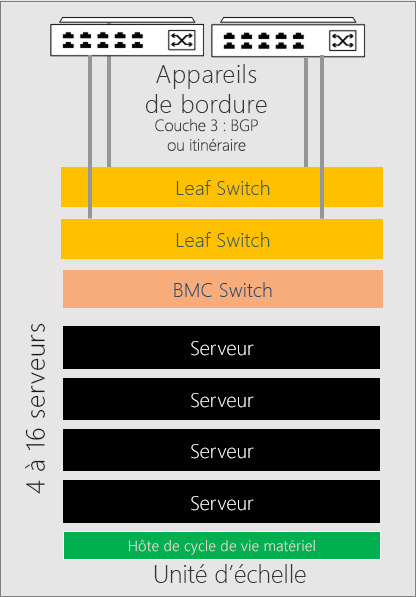
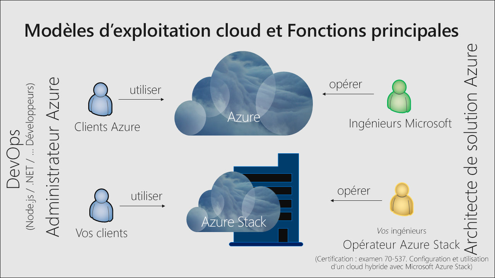

# Vue d’ensemble d’Azure Stack Hub

Azure Stack Hub est une extension d’Azure qui permet d’exécuter des applications dans un environnement local et de fournir des services Azure dans votre centre de données. Avec une plateforme cloud cohérente, les organisations peuvent prendre en toute confiance des décisions informatiques en fonction des besoins métier, plutôt que des décisions métier en fonction de limitations informatiques.

## Pourquoi utiliser Azure Stack Hub ?

Azure met à la disposition des développeurs une plateforme complète pour la création d’applications modernes. Cependant, certaines applications cloud doivent faire face à des obstacles comme la latence, une connectivité intermittente et des réglementations. Azure et Azure Stack Hub permettent de nouveaux cas d’utilisation du cloud hybride pour les applications métier internes et orientées client :

- **Solutions edge et déconnectées**. Répondez aux exigences de latence et de connectivité en traitant les données localement dans Azure Stack Hub, puis en les agrégeant dans Azure pour une analytique plus poussée, avec une logique d’application commune. Vous pouvez même déployer Azure Stack Hub déconnecté d’Internet sans connectivité à Azure. Les ateliers, les bateaux de croisière et les puits de mine sont quelques exemples.

- **Applications cloud conformes à différentes réglementations**. Développez et déployez des applications dans Azure, en profitant d’une flexibilité complète pour déployer localement avec Azure Stack Hub pour répondre à des exigences réglementaires ou stratégiques. Le code n’a pas besoin d’être modifié. L’audit global, les rapports financiers, les opérations de change, les jeux en ligne et les notes de frais sont des exemples d’applications.

- **Modèle d’application cloud locale.** Utilisez les services, les conteneurs ainsi que les architectures serverless et de microservices Azure pour mettre à jour et étendre des applications existantes ou en créer. Utilisez des processus DevOps cohérents sur Azure dans le cloud et sur Azure Stack Hub localement pour accélérer la modernisation des applications critiques.

## Architecture d’Azure Stack Hub

Les systèmes Azure Stack Hub intégrés sont constitués de racks de 4 à 16 serveurs construits par des fournisseurs de matériel partenaires approuvés et livrés directement à votre centre de données. Après la livraison, un fournisseur de solutions collabore avec vous pour déployer le système intégré et faire en sorte que la solution Azure Stack Hub réponde aux besoins de votre entreprise. Vous pouvez préparer votre centre de données en vérifiant que toutes les spécifications pour l’intégration du centre de données, comme l’alimentation, le refroidissement et la connectivité périphérique, sont en place.

> Pour plus d’informations sur l’expérience d’intégration des centres de données Azure Stack Hub, consultez [Intégration du centre de données Azure Stack Hub](azure-stack-customer-journey.md).

Azure Stack Hub s’appuie sur du matériel standard du secteur et il est géré à l’aide des outils que vous utilisez déjà pour la gestion des abonnements Azure. Ainsi, vous pouvez appliquer des processus DevOps cohérents, que vous soyez ou non connecté à Azure.

L’architecture d’Azure Stack Hub vous permet de fournir des services Azure à la périphérie pour des emplacements distants ou une connectivité intermittente, en étant déconnecté d’Internet. Vous pouvez créer des solutions hybrides qui traitent les données localement dans Azure Stack Hub, et les agrègent ensuite dans Azure en vue d’un traitement ou d’une analytique supplémentaire. Enfin, Azure Stack Hub étant installé localement, vous pouvez satisfaire à des exigences réglementaires ou stratégiques spécifiques avec la flexibilité du déploiement d’applications cloud localement sans modifier le code.

## Options de déploiement

Les systèmes intégrés Azure Stack Hub sont disponibles via un partenariat entre Microsoft et des fournisseurs de matériel partenaires, qui aboutit à la création d’une solution combinant innovation cloud et simplicité de gestion. Comme Azure Stack Hub est offert sous la forme d’un système matériel et logiciel intégré, vous avez la flexibilité et le contrôle dont vous avez besoin, ainsi que la capacité à innover depuis le cloud. 

Un système intégré Azure Stack Hub peut varier en taille de 4 à 16 serveurs, appelée *unité d’échelle*. Les systèmes intégrés sont pris en charge conjointement par le partenaire fournisseur de matériel et Microsoft. Le diagramme suivant présente un exemple d’unité d’échelle. 

. 

<!---add info and image on regions, etc--->

### Modèles de connexion

Vous pouvez choisir de déployer Azure Stack Hub **connecté**  à Internet (et à Azure) ou **déconnecté** d’Internet. 

> Pour plus d’informations, consultez les considérations relatives aux modèles de déploiement [connectés](azure-stack-connected-deployment.md) et [déconnectés](azure-stack-disconnected-deployment.md).

### Fournisseur d’identité 

Azure Stack Hub utilise Azure Active Directory (Azure AD) ou Active Directory Federation Services (AD FS). Azure AD est le fournisseur d’identité Microsoft multilocataire basé sur le cloud. La plupart des scénarios hybrides comportant des déploiements connectés à Internet utilisent Azure AD comme magasin d’identités.

Pour les déploiements déconnectés d’Azure Stack Hub, vous devez utiliser AD FS. Les fournisseurs de ressources Azure Stack Hub et les autres applications fonctionnent de façon similaire avec AD FS ou Azure AD. Azure Stack Hub inclut sa propre instance d’Active Directory ainsi qu’une API Graph Active Directory.

## Comment Azure Stack Hub est-il géré ?

Azure Stack Hub utilise le même modèle d’opérations qu’Azure. Un opérateur Azure Stack Hub peut fournir un large éventail de services et d’applications aux utilisateurs locataires, de la même façon que Microsoft fournit des services Azure aux utilisateurs locataires. 

Vous pouvez gérer Azure Stack Hub avec le portail administrateur, le portail utilisateur ou [PowerShell](https://docs.microsoft.com/powershell/azure/azure-stack/overview?view=azurestackps-1.7.1). Les portails Azure Stack Hub sont chacun secondés par des instances distinctes d’Azure Resource Manager. Un **opérateur Azure Stack Hub** utilise le portail administrateur pour gérer Azure Stack Hub, et pour effectuer des opérations comme la création d’offres de locataire, la gestion de l’intégrité du système intégré et la supervision de son état. Le portail utilisateur fournit une expérience en libre-service pour la consommation de ressources cloud comme des machines virtuelles, des comptes de stockage et des applications web.

> Pour plus d’informations sur la gestion d’Azure Stack Hub avec le portail administrateur, consultez le [guide de démarrage rapide consacré au portail d’administration d’Azure Stack Hub](azure-stack-manage-portals.md).

En tant qu’opérateur Azure Stack Hub, vous pouvez fournir des [machines virtuelles](azure-stack-tutorial-tenant-vm.md), des [applications web](azure-stack-app-service-overview.md) et des bases de données [SQL Server](azure-stack-tutorial-sql.md) et [MySQL Server](azure-stack-tutorial-mysql.md) à haute disponibilité. Vous pouvez également utiliser les [modèles Azure Resource Manager fournis dans le guide de démarrage rapide consacré à Azure Stack Hub](https://github.com/Azure/AzureStack-QuickStart-Templates) pour déployer des produits comme SharePoint ou Exchange.

Un opérateur peut gérer Azure Stack Hub avec le [portail administrateur](azure-stack-manage-portals.md) ou [PowerShell](https://docs.microsoft.com/powershell/azure/azure-stack/overview?view=azurestackps-1.7.1). Vous pouvez configurer Azure Stack Hub pour [fournir des services](service-plan-offer-subscription-overview.md) à des locataires en utilisant des plans, des quotas, des offres et des abonnements. Les locataires peuvent s’abonner à plusieurs offres. Les offres peuvent contenir un ou plusieurs plans, et les plans peuvent contenir un ou plusieurs services. Les opérateurs gèrent aussi la capacité et répondent aux alertes.

Les utilisateurs consomment les services offerts par l’opérateur. Les utilisateurs peuvent provisionner, superviser et gérer les services auxquels ils sont abonnés, comme des applications web, du stockage et des machines virtuelles. Les utilisateurs peuvent gérer Azure Stack Hub avec le portail utilisateur ou PowerShell.

> Pour en savoir plus sur la gestion d’Azure Stack Hub, notamment les comptes à utiliser selon les situations, les responsabilités classiques de l’opérateur, les informations à communiquer à vos utilisateurs et la façon d’obtenir de l’aide, passez en revue les [principes fondamentaux de l’administration d’Azure Stack Hub](azure-stack-manage-basics.md).

## Fournisseurs de ressources

Les fournisseurs de ressources sont les services web qui constituent la base de tous les services IaaS et PaaS d’Azure Stack Hub. Azure Resource Manager s’appuie sur différents fournisseurs de ressources pour fournir l’accès aux services. Chaque fournisseur de ressources vous permet de configurer et contrôler ses ressources respectives. Les administrateurs de services peuvent également ajouter de nouveaux fournisseurs de ressources personnalisés.

### Fournisseurs de ressources fondamentaux

Il existe trois fournisseurs de ressources IaaS fondamentaux :

- **Calcul** : Le fournisseur de ressources de calcul permet aux locataires Azure Stack Hub de créer leurs propres machines virtuelles. Le fournisseur de ressources de calcul inclut la possibilité de créer des machines virtuelles ainsi que des extensions de machine virtuelle. Le service d’extension de machine virtuelle fournit des fonctionnalités IaaS pour les machines virtuelles Windows et Linux. Par exemple, vous pouvez utiliser le fournisseur de ressources de calcul pour provisionner une machine virtuelle Linux et exécuter des scripts Bash lors du déploiement pour configurer la machine virtuelle.
- **Fournisseur de ressources réseau** : Le fournisseur de ressources réseau offre une série de fonctionnalités SDN (Software Defined Networking) et NFV (Network Function Virtualization) pour le cloud privé. Vous pouvez utiliser le fournisseur de ressources réseau pour créer des ressources telles que des équilibreurs de charge logiciels, des adresses IP publiques, des groupes de sécurité réseau et des réseaux virtuels.
- **Fournisseur de ressources de stockage** : Le fournisseur de ressources de stockage propose quatre services de stockage cohérents au niveau d’Azure : [objet blob](https://docs.microsoft.com/azure/storage/common/storage-introduction#blob-storage), [file d’attente](https://docs.microsoft.com/azure/storage/common/storage-introduction#queue-storage), [table](https://docs.microsoft.com/azure/storage/common/storage-introduction#table-storage) et gestion de comptes [Key Vault](https://docs.microsoft.com/azure/key-vault/) pour la gestion et l’audit des secrets, comme les mots de passe et les certificats. Le fournisseur de ressources de stockage offre également un service d’administration de stockage cloud pour faciliter l’administration du fournisseur de services de stockage cohérents au niveau d’Azure. Stockage Azure offre la flexibilité nécessaire pour stocker et récupérer de grandes quantités de données non structurées, comme des documents et des fichiers multimédias avec des objets blob Azure, et de données NoSQL structurées avec des tables Azure.

### Fournisseurs de ressources facultatifs

Il existe trois fournisseurs de ressources PaaS facultatifs que vous pouvez déployer et utiliser avec Azure Stack Hub :

- **Service d’application** : [Azure App Service sur Azure Stack Hub](azure-stack-app-service-overview.md) est une offre PaaS de Microsoft Azure disponible sur Azure Stack Hub. Le service permet à vos clients internes ou externes de créer des applications web, API et Azure Functions pour la plateforme ou l’appareil de leur choix.
- **SQL Server** : Utilisez le [fournisseur de ressources SQL Server](azure-stack-sql-resource-provider.md) pour offrir des bases de données SQL en tant que service d’Azure Stack Hub. Après avoir installé le fournisseur de ressources et l’avoir connecté à une ou plusieurs instances SQL Server, vous et vos utilisateurs pouvez créer des bases de données pour des applications natives cloud, des sites web qui utilisent SQL et d’autres charges de travail qui utilisent SQL.
- **MySQL Server** : Utilisez le [fournisseur de ressources MySQL Server](azure-stack-mysql-resource-provider-deploy.md) pour exposer des bases de données MySQL en tant que service d’Azure Stack Hub. Le fournisseur de ressources MySQL s’exécute en tant que service sur une machine virtuelle Windows Server 2019 Server Core.

## Étapes suivantes

[Comparer le portefeuille Azure Stack Hub](compare-azure-azure-stack.md)

[Informations de base sur l’administration](azure-stack-manage-basics.md)

[Démarrage rapide : Utiliser le portail d’administration Azure Stack Hub](azure-stack-manage-portals.md)

[Comprendre l’utilisation et la facturation](azure-stack-usage-reporting.md).
