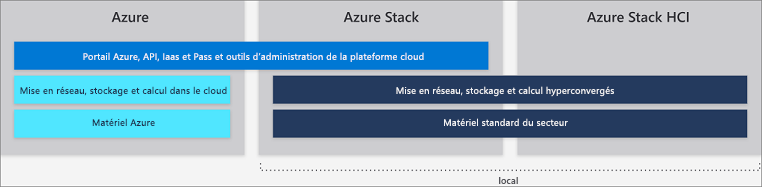

# Différences entre Azure international, Azure Stack Hub et Azure Stack HCI

Microsoft fournit Azure et la famille de services Azure Stack Hub dans un même écosystème Azure. Utilisez les mêmes modèle d’application, portails en libre service et API avec Azure Resource Manager pour fournir des fonctionnalités basées sur le cloud, que votre entreprise utilise Azure international ou des ressources locales.

Cet article explique les différences de fonctionnalités qui existent entre Azure international, Azure Stack Hub et Azure Stack HCI. Il fournit des recommandations concernant les scénarios courants afin de vous aider à fournir les bons services cloud Microsoft à votre organisation.

## Azure global

Microsoft Azure est un ensemble sans cesse croissant de services cloud destinés à aider votre organisation à relever les défis auxquels elle est confrontée. Il vous permet de créer, de gérer et de déployer des applications sur un énorme réseau mondial en utilisant vos frameworks et outils favoris.

Azure international propose plus de 100 services disponibles dans 54 régions du monde. Pour obtenir la liste actualisée des services Azure international, consultez la page [*Disponibilité des produits par région*](https://azure.microsoft.com/regions/services). Cette page liste les services disponibles dans Azure par catégorie et indique leur niveau de disponibilité (générale ou en préversion).

Pour plus d’informations sur les services Azure international, consultez [Bien démarrer avec Azure](https://docs.microsoft.com/azure/?pivot=get-started&panel=get-started1).

## Azure Stack Hub

Azure Stack Hub est une extension d’Azure qui intègre l’agilité et l’innovation du cloud computing à vos environnements locaux. Déployé localement, Azure Stack Hub peut être utilisé pour fournir des services cohérents au niveau Azure, soit connecté à Internet (et Azure), soit dans des environnements déconnectés sans connectivité Internet. Azure Stack Hub utilise les mêmes technologies sous-jacentes qu’Azure international, y compris les composants principaux des fonctionnalités IaaS, SaaS et PaaS (facultatives). Ces fonctionnalités sont les suivantes :

- Machines virtuelles Azure pour Windows et Linux
- Azure Web Apps et Azure Fonctions
- Azure Key Vault
- Azure Resource Manager
- Place de marché Azure
- Containers
- Outils d’administration (plans, offres, RBAC, etc.)

Les fonctionnalités PaaS d’Azure Stack Hub sont facultatives, car Azure Stack Hub n’est pas géré par Microsoft, mais par nos clients. Cela signifie que vous pouvez proposer n’importe quel service PaaS aux utilisateurs finaux si vous êtes prêt à leur retirer l’infrastructure et les processus sous-jacents. Toutefois, Azure Stack Hub comprend plusieurs fournisseurs de services PaaS facultatifs, notamment App Service, les bases de données SQL et les bases de données MySQL. Ces fournisseurs étant livrés comme des fournisseurs de ressources, ils sont multilocataires, bénéficient régulièrement de mises à jour Azure Stack Hub standard, sont visibles dans le portail Azure Stack Hub et sont bien intégrés à Azure Stack Hub.

En plus des fournisseurs de ressources décrits ci-dessus, il existe des services PaaS disponibles et testés en tant que [solutions basées sur des modèles Azure Resource Manager](https://github.com/Azure/AzureStack-QuickStart-Templates) qui s’exécutent dans IaaS. Toutefois, en tant qu’opérateur Azure Stack Hub, vous pouvez les proposer en tant que services PaaS à vos utilisateurs :

- Service Fabric
- Service conteneur Kubernetes
- Blockchain Ethereum
- Cloud Foundry

### Exemples de cas d’utilisation pour Azure Stack Hub :

- Modélisation financière
- Données cliniques et relatives aux réclamations
- Analytique des appareils IoT
- Optimisation de l’assortiment dans la distribution
- Optimisation de la chaîne d’approvisionnement
- IoT industriel
- Maintenance prédictive
- Ville intelligente
- Engagement des citoyens

Apprenez-en davantage sur Azure Stack Hub avec [Présentation d’Azure Stack Hub](azure-stack-overview.md).

## Azure Stack HCI

Les solutions [Azure Stack HCI](../hci/overview.md) vous permettent d’exécuter des machines virtuelles localement et de vous connecter facilement à Azure avec une solution d’infrastructure hyperconvergée (HCI). Créez et exécutez des applications cloud en utilisant des services Azure cohérents localement pour répondre aux exigences réglementaires ou techniques. En plus d’exécuter des applications virtualisées localement, Azure Stack HCI vous permet de remplacer et de consolider une infrastructure de serveur vieillissante et de vous connecter à Azure pour les services cloud à l’aide de Windows Admin Center.

Azure Stack HCI fournit des solutions HCI validées bénéficiant des technologies Hyper-V et des espaces de stockage direct avec le SDDC (Software-Defined Datacenter) Windows Server 2019. Windows Admin Center est utilisé pour la gestion et l’accès intégré aux services Azure tels que :

- Sauvegarde Azure
- Azure Site Recovery
- Azure Monitor and Update

Pour obtenir une liste mise à jour des services Azure auxquels vous pouvez connecter Azure Stack HCI, consultez [Connexion de Windows Server aux services Azure hybrides](https://docs.microsoft.com/windows-server/azure-hybrid-services/index).

### Exemples de cas d’utilisation pour Azure Stack HCI

- Systèmes de bureau distant ou de succursale
- Consolidation de centre de données
- Infrastructure de bureau virtuel
- Infrastructure critique pour l’entreprise
- Stockage à moindre coût
- Haute disponibilité et reprise d’activité dans le cloud
- Applications d’entreprise telles que SQL Server

Visitez le [site web Azure Stack HCI](https://azure.microsoft.com/overview/azure-stack/hci/) pour découvrir plus de 70 solutions Azure Stack HCI disponibles auprès des partenaires Microsoft.

## Étapes suivantes

[Principes de bases de l’administration d’Azure Stack Hub](azure-stack-manage-basics.md)

[Démarrage rapide : Utiliser le portail d’administration Azure Stack Hub](azure-stack-manage-portals.md)
