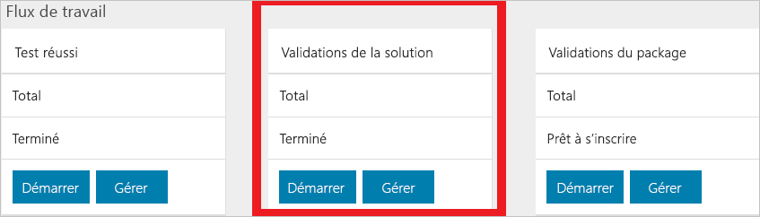
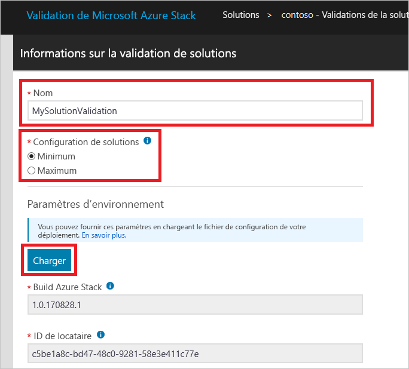
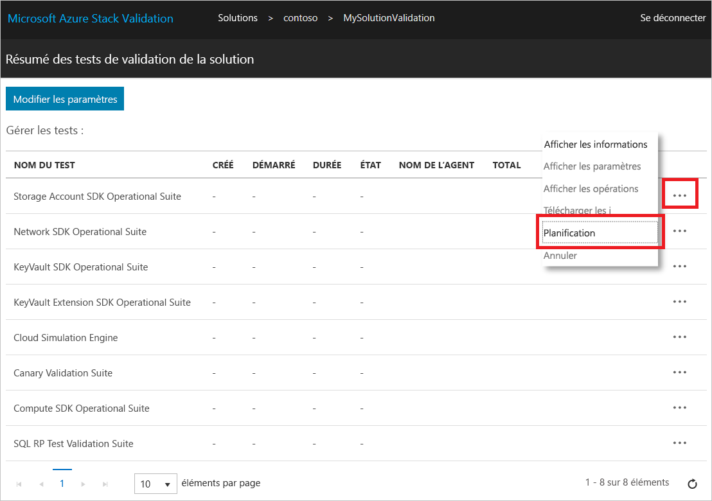

# Valider une solution dans Azure Stack Hub

[!INCLUDE [Azure_Stack_Partner](./includes/azure-stack-partner-appliesto.md)]

Découvrez comment utiliser le workflow de **validation de solution** pour valider les nouvelles solutions Azure Stack Hub.

Une solution Azure Stack Hub est une nomenclature matérielle qui a été convenue conjointement entre Microsoft et le partenaire après avoir satisfait aux exigences de certification du logo Windows Server. Une solution doit être renouvelée en cas d’une modification de la nomenclature matérielle. Si vous avez d’autres questions sur la revalidation des solutions, contactez l’équipe à l’adresse [vaashelp@microsoft.com](mailto:vaashelp@microsoft.com).

Pour valider votre solution, exécutez deux fois le workflow de validation de solution. Exécutez-le une première fois pour la configuration *minimale* prise en charge. Exécutez-le une seconde fois pour la configuration *maximale* prise en charge. Microsoft valide la solution si les deux configurations réussissent tous les tests.

[!INCLUDE [azure-stack-vaas-workflow-validation-completion](includes/azure-stack-vaas-workflow-validation-completion.md)]

## Créer un workflow de validation de solution

1. [!INCLUDE [azure-stack-vaas-workflow-step_select-solution](includes/azure-stack-vaas-workflow-step_select-solution.md)]

2. Sélectionnez **Démarrer** sur la vignette **Validations de solution**.

    

3. [!INCLUDE [azure-stack-vaas-workflow-step_naming](includes/azure-stack-vaas-workflow-step_naming.md)]

4. Sélectionnez la **Configuration de la solution**.
    - **Minimale** : la solution est configurée avec le nombre minimal de nœuds pris en charge.
    - **Maximale** : la solution est configurée avec le nombre maximal de nœuds pris en charge.
5. [!INCLUDE [azure-stack-vaas-workflow-step_upload-stampinfo](includes/azure-stack-vaas-workflow-step_upload-stampinfo.md)]

    

6. [!INCLUDE [azure-stack-vaas-workflow-step_test-params](includes/azure-stack-vaas-workflow-step_test-params.md)]

    > [!NOTE]
    > Après la création d’un workflow, les paramètres d’environnement ne peuvent plus être modifiés.

7. [!INCLUDE [azure-stack-vaas-workflow-step_tags](includes/azure-stack-vaas-workflow-step_tags.md)]
8. [!INCLUDE [azure-stack-vaas-workflow-step_submit](includes/azure-stack-vaas-workflow-step_submit.md)]
    Vous allez être redirigé vers la page de résumé des tests.

## Exécuter des tests de validation de solution

Dans la page **Résumé des tests de validation de solution**, vous trouverez une liste des tests à réaliser pour terminer la validation.

Dans les workflows de validation, la **planification** d’un test utilise les paramètres communs au niveau du workflow que vous avez spécifiés lors de la création de votre workflow (voir [Paramètres de workflow communs dans la validation en tant que service Azure Stack Hub](azure-stack-vaas-parameters.md)). Si l’une des valeurs de paramètres de test devient non valide, vous devez les redéfinir comme indiqué dans [Modifier les paramètres de workflow](azure-stack-vaas-monitor-test.md#change-workflow-parameters).

> [!NOTE]
> La planification d’un test de validation sur une instance existante créera une nouvelle instance à la place de l’ancienne contenue dans le portail. Les journaux d’activité de l’ancienne instance sont conservés, mais ne sont pas accessibles à partir du portail. 
Dès lors qu’un test est concluant, l’action de **planification** est désactivée.

1. [!INCLUDE [azure-stack-vaas-workflow-step_select-agent](includes/azure-stack-vaas-workflow-step_select-agent.md)]

2. Sélectionnez les tests suivants :
    - Cloud Simulation Engine
    - Disk Identification Test

3. Sélectionnez **Planifier** dans le menu contextuel pour ouvrir une invite de planification de l’instance de test.

4. Passez en revue les paramètres de test, puis sélectionnez **Envoyer** pour planifier l’exécution du test.

## Étapes suivantes

- [Surveiller et gérer les tests dans le portail VaaS](azure-stack-vaas-monitor-test.md)