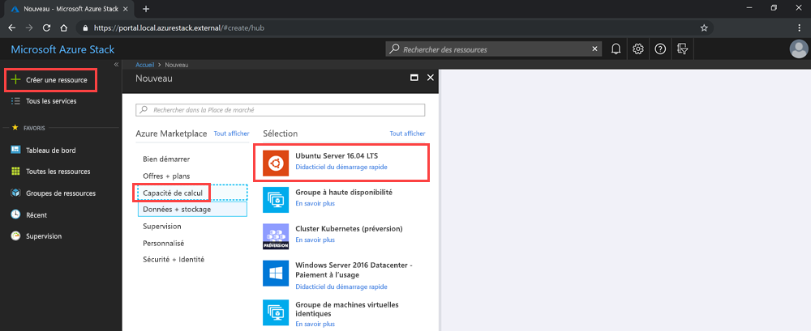

# <a name="deploy-a-linux-vm-to-host-a-web-app-in-azure-stack"></a>Déployer une machine virtuelle Linux pour héberger une application web dans Azure Stack

Vous pouvez créer et déployer une machine virtuelle Linux de base avec l’image Ubuntu de la Place de marché Azure pour héberger l’application web que vous avez créée avec une infrastructure web. 

Cette machine virtuelle peut héberger des applications web avec :

- **Python** : Flask, Bottle et Django figurent au nombre des frameworks web Python les plus courants.
- **Go** : Revel, Martini, Gocraft/web et Gorilla figurent au nombre des frameworks web Go les plus courants. 
- **Ruby** : Configurez une infrastructure Ruby on Rails de façon à distribuer des applications web Ruby. 
- **Java** : Utilisez Java pour développer des applications web que vous publiez sur un serveur Apache Tomcat. Vous pouvez installer Tomcat sur Linux, puis déployer directement vos fichiers WAR Java sur le serveur. 

Les instructions de cet article permettent de se familiariser avec tous types d’applications web, d’infrastructures et de technologies back-end qui utilisent le système d’exploitation Linux. Vous pouvez ensuite utiliser Azure Stack pour gérer votre infrastructure, ainsi que les outils de gestion au sein de votre technologie pour mener à bien les tâches de maintenance de votre application.

## <a name="deploy-a-linux-vm-for-a-web-app"></a>Déployer une machine virtuelle Linux pour une application web

Dans ce processus, créez une clé secrète, utilisez l’image de base de la machine virtuelle Linux, spécifiez ses attributs particuliers, puis créez la machine virtuelle. Une fois que vous avez créé la machine virtuelle, ouvrez les ports qui sont nécessaires pour travailler avec elle et pour que la machine virtuelle héberge votre application. Créez ensuite le nom DNS. Enfin, connectez-vous à la machine virtuelle et mettez-la à jour avec l’utilitaire apt-get. Une fois que vous avez effectué le processus, vous disposez d’une machine virtuelle dans votre instance Azure Stack qui est prête à héberger votre application web.

Avant de commencer, vérifiez que tout ce dont vous avez besoin est en place.

## <a name="prerequisites"></a>Prérequis

- Un abonnement Azure Stack, avec accès à l’image Ubuntu Server 16.04 LTS. Il est possible d’utiliser une version ultérieure de l’image, mais ces instructions sont écrites spécifiquement pour 16.04 LTS. Si vous n’avez pas cette image, contactez votre opérateur cloud pour l’obtenir dans la Place de marché Azure Stack.

## <a name="deploy-the-vm-by-using-the-portal"></a>Déployer la machine virtuelle en utilisant le portail

Pour déployer la machine virtuelle, suivez les instructions indiquées dans les sections suivantes.

### <a name="create-your-vm"></a>Créer votre machine virtuelle

1. Créez une clé publique SSH (Secure Shell) pour votre serveur. Pour plus d’informations, voir [Guide pratique pour utiliser une clé publique SSH](azure-stack-dev-start-howto-ssh-public-key.md).
1. Dans le portail Azure Stack, sélectionnez **Créer une ressource** > **Calcul** > **Ubuntu Server 16.04 LTS**.

    

4. Dans le volet **Créer une machine virtuelle**, pour **1. Configurer les paramètres de base** :

    a. Entrez le **nom de votre machine virtuelle**.

    b. Sélectionnez le **type de disque de machine virtuelle** : **SSD Premium** (pour les disques Premium [SSD]) ou **HDD Standard** (pour les disques Standard [HDD]).

    c. Entrez votre **nom d’utilisateur**.

    d. Sélectionnez **Clé publique SSH** comme **Type d’authentification**.

    e. Récupérez la clé publique SSH que vous avez créée. Ouvrez-la dans un éditeur de texte, copiez-la et collez-la dans la zone **Clé publique SSH** en prenant en compte le texte entre `---- BEGIN SSH2 PUBLIC KEY ----` et `---- END SSH2 PUBLIC KEY ----`. Collez l’intégralité du bloc de texte dans la zone de clé :

    ```text  
    ---- BEGIN SSH2 PUBLIC KEY ----
    Comment: "rsa-key-20190207"
    <Your key block>
    ---- END SSH2 PUBLIC KEY ----
    ```

    f. Sélectionnez l’abonnement pour votre instance Azure Stack.

    g. Créez un groupe de ressources ou utilisez-en un existant, en fonction de la façon dont vous souhaitez organiser les ressources pour votre application.

    h. Sélectionnez votre emplacement. Le Kit de développement Azure Stack (ASDK) est généralement situé dans une région *locale*. L’emplacement dépend de votre instance Azure Stack.
1. Pour **2. Taille**, entrez :
    - Sélectionnez la taille de données et de RAM pour votre machine virtuelle qui est disponible dans votre instance Azure Stack.
    - Vous pouvez parcourir la liste ou définir un filtre pour la taille de votre machine virtuelle par **type de calcul**, **processeur** et **espace de stockage**.
    
    > [!NOTE]
    > - Les prix présentés sont des estimations en devise locale. Ils incluent uniquement les coûts d’infrastructure Azure et les remises pour l’abonnement et l’emplacement. Ils n’incluent pas les coûts logiciels applicables. 
    > - Les tailles recommandées sont déterminées par l’éditeur de l’image sélectionnée en fonction de la configuration matérielle et logicielle requise.
    > - L’utilisation de disques Standard (HDD) au lieu de disques Premium (SSD) peut affecter les performances du système d’exploitation.

1. Dans **3. Configurer les fonctionnalités facultatives**, entrez :

    a. Pour **Haute disponibilité,** sélectionnez un groupe à haute disponibilité. Pour assurer la redondance de votre application, regroupez au moins deux machines virtuelles dans un groupe à haute disponibilité. Cette configuration assure qu’au moins une des machines virtuelles est disponible pendant un événement de maintenance planifié ou non et répond au 99,95 % inscrits dans le contrat SLA Azure. Vous ne pouvez pas modifier le groupe à haute disponibilité d’une machine virtuelle après sa création.

    b. Pour **Stockage**, sélectionnez **Disques Premium (SSD)** ou **Disques Standard (HDD)** . Les disques Premium (SSD) sont associés à des disques SSD afin d’offrir des performances constantes et une faible latence. Ils proposent le meilleur rapport prix/performances et conviennent parfaitement aux charges de travail de production et aux applications nécessitant beaucoup d’E/S. Les disques Standard sont associés à des lecteurs magnétiques et conviennent davantage aux applications dont les données sont rarement utilisées. Les disques redondants interzones sont associés à un stockage redondant interzone (ZRS) qui réplique vos données sur plusieurs zones, et restent disponibles même si une zone n’est pas disponible. 

    c. Sélectionnez **Utiliser des disques managés**. Lorsque vous activez cette fonctionnalité, Azure gère automatiquement la disponibilité des disques. Vous bénéficiez de la redondance des données et de la tolérance de panne, sans avoir à créer ni à gérer des comptes de stockage vous-même. Les disques managés peuvent ne pas être disponibles dans toutes les régions. Pour plus d’informations, consultez [Présentation des disques managés Azure](https://docs.microsoft.com/azure/virtual-machines/windows/managed-disks-overview).

    d. Pour configurer votre réseau, sélectionnez **Réseau virtuel**. Les réseaux virtuels sont isolés logiquement les uns des autres dans Azure. Vous pouvez configurer les plages d’adresses IP, sous-réseaux, tables de routage, passerelles et paramètres de sécurité, comme pour un réseau traditionnel dans votre centre de données. Des machines virtuelles situées dans le même réseau virtuel peuvent accéder les unes aux autres par défaut. 

    e. Pour configurer votre sous-réseau, sélectionnez **Sous-réseau**. Un sous-réseau est une plage d’adresses IP dans votre réseau virtuel. Vous pouvez utiliser un sous-réseau pour isoler les machines virtuelles les unes des autres ou d’Internet. 

    f. Pour configurer l’accès à votre machine virtuelle ou aux services en cours d’exécution sur votre machine virtuelle, sélectionnez **Adresse IP publique**. Utilisez une adresse IP publique pour communiquer avec la machine virtuelle en dehors du réseau virtuel. 

    g. Sélectionnez **Groupe de sécurité réseau**, **De base** ou **Avancé**. Définissez des règles qui autorisent ou refusent le trafic réseau sur la machine virtuelle. 

    h. Pour définir l’accès pour les protocoles courants ou personnalisés à votre machine virtuelle, sélectionnez **Ports d’entrée publics**. Le service spécifie la plage de ports et le protocole de destination pour cette règle. Vous pouvez choisir un service prédéfini, tel que le protocole RDP (Remote Desktop) ou SSH, ou fournir une plage de ports personnalisée. 
        Pour le serveur web, utilisez HTTP (80), HTTPS (443) et SSH (22). Si vous prévoyez de gérer la machine à l’aide d’une connexion RDP, ouvrez le port 3389.

    i. Pour ajouter des extensions à votre machine virtuelle, sélectionnez **Extensions**. Les extensions ajoutent de nouvelles fonctionnalités, par exemple la gestion des configurations ou la protection antivirus, à votre machine virtuelle. 

    j. Activez ou désactivez **Monitoring (Surveillance)** . Pour aider à diagnostiquer les problèmes de démarrage, vous pouvez utiliser la surveillance pour capturer des captures d’écran et la sortie de la console série d’une machine virtuelle qui est en cours d’exécution sur un hôte. 

    k. Pour spécifier le compte de stockage qui contient vos métriques, sélectionnez **Compte de stockage des diagnostics**. Les métriques sont écrites dans un compte de stockage et vous pouvez ensuite les analyser avec vos propres outils. 

    l. Sélectionnez **OK**.

1. Passez en revue **4. Summary (Synthèse)**  :
    - Le portail valide vos paramètres.
    - Pour réutiliser vos paramètres avec un workflow Azure Resource Manager, vous pouvez télécharger le modèle Azure Resource Manager pour votre machine virtuelle.
    - Lorsque la validation a réussi, sélectionnez **OK**. Le déploiement d’une machine virtuelle prend plusieurs minutes.

### <a name="specify-the-open-ports-and-dns-name"></a>Spécifier les ports ouverts et le nom DNS

Pour que votre application web soit accessible aux utilisateurs sur votre réseau, ouvrez les ports utilisés pour la connexion à la machine et ajoutez un nom DNS convivial, tel que *mywebapp.local.cloudapp.azurestack.external*, que les utilisateurs peuvent utiliser dans leur navigateur web.

#### <a name="open-inbound-ports"></a>Ports entrants ouverts

Vous pouvez modifier la plage de ports et le protocole de destination pour un service prédéfini, comme RDP ou SSH, ou fournir une plage de ports personnalisée. Par exemple, vous pouvez utiliser la plage de ports de votre infrastructure web. GO, par exemple, communique sur le port 3000.

1. Ouvrez le portail Azure Stack de votre locataire.

1. Recherchez votre machine virtuelle. Vous l’avez peut-être épinglée sur votre tableau de bord ; sinon, vous pouvez la rechercher dans la zone **Rechercher des ressources**.

1. Sélectionnez **Mise en réseau** dans le volet de votre machine virtuelle.

1. Sélectionnez **Ajouter une règle de port d’entrée** pour ouvrir un port.

1. Pour **Source**, conservez la sélection par défaut **Any (Tous)** .

1. Pour **Plage de ports source**, laissez le caractère générique (*).

1. Pour **Plage de ports de destination**, entrez le port que vous souhaitez ouvrir, tel que **3000**.

1. Pour **Protocole**, conservez la sélection par défaut, **Tous**.

1. Pour **Action**, sélectionnez **Autoriser**.

1. Pour **Priorité**, conservez la sélection par défaut.

1. Entrez un **nom** et une **description** pour vous rappeler la raison pour laquelle le port est ouvert.

1. Sélectionnez **Ajouter**.

#### <a name="add-a-dns-name-for-your-server"></a>Ajouter un nom DNS pour votre serveur

En outre, vous pouvez créer un nom DNS pour votre serveur, afin que les utilisateurs puissent se connecter à votre site web à l’aide d’une URL.

1. Ouvrez le portail Azure Stack de votre locataire.

1. Recherchez votre machine virtuelle. Vous l’avez peut-être épinglée sur votre tableau de bord ; sinon, vous pouvez la rechercher dans la zone **Rechercher des ressources**.

1. Sélectionnez **Vue d’ensemble**.

1. Sous **Machine virtuelle**, sélectionnez **Configurer**.

1. Pour **Attribution**, sélectionnez **Dynamique**.

1. Entrez l’étiquette de nom DNS, telle que **mywebapp**, de sorte que votre URL complète devient *mywebapp.local.cloudapp.azurestack.external* (pour une application ASDK).

### <a name="connect-via-ssh-to-update-your-vm"></a>Se connecter via le protocole SSH pour mettre à jour votre machine virtuelle

1. Sur le même réseau que votre instance Azure Stack, ouvrez votre client SSH. Pour plus d’informations, consultez [Utiliser une clé publique SSH](azure-stack-dev-start-howto-ssh-public-key.md).

1. Entrez les commandes suivantes :

    ```bash  
        sudo apt-get update
        sudo apt-get -y upgrade
    ```

## <a name="next-steps"></a>Étapes suivantes

Découvrez comment [configurer un environnement de développement dans Azure Stack](azure-stack-dev-start.md).
