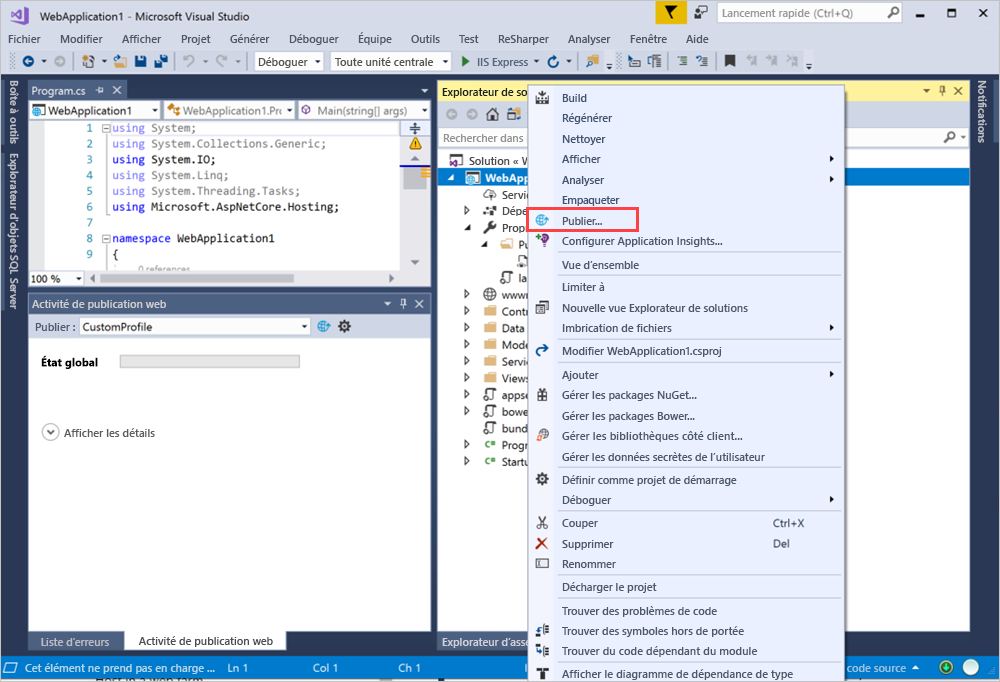
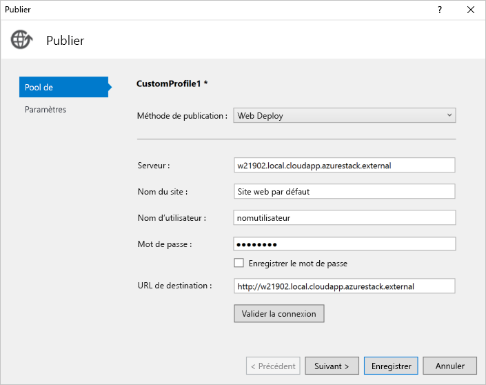

# <a name="deploy-a-c-aspnet-web-app-to-a-vm-in-azure-stack-hub"></a>Déployer une application web ASP.NET C# sur une machine virtuelle dans Azure Stack Hub

Vous pouvez créer une machine virtuelle pour héberger votre application web ASP.NET C# dans Azure Stack Hub. Cet article décrit les instructions à suivre pour installer votre serveur, le configurer pour héberger votre application web ASP.NET C# puis ensuite déployer l’application directement à partir de Visual Studio.

Cet article utilise une application C# 6.0 qui utilise ASP.NET Core 2.2 sur un serveur Windows 2016.

## <a name="create-a-vm"></a>Créer une machine virtuelle

1. Créez une [machine virtuelle Windows Server](azure-stack-quick-windows-portal.md).

1. Pour installer IIS (avec la Console de gestion) et les composants ASP.NET 4.6 sur votre machine virtuelle, exécutez le script suivant :

    ```PowerShell  
    # Install IIS (with Management Console)
    Install-WindowsFeature -name Web-Server -IncludeManagementTools
    
    # Install ASP.NET 4.6
    Install-WindowsFeature Web-Asp-Net45
    
    # Install Web Management Service
    Install-WindowsFeature -Name Web-Mgmt-Service
    ```

1. Téléchargez [Web Deploy v3.6](https://www.microsoft.com/download/details.aspx?id=43717). Installez Web Deploy à partir du fichier MSI, puis activez toutes les fonctionnalités.

1. Installez le bundle d’hébergement .NET Core 2.2 sur votre serveur. Pour obtenir des instructions, consultez [Programme d’installation .NET Core](https://dotnet.microsoft.com/download/dotnet-core/2.2). Utilisez la même version de .NET Core sur votre ordinateur de développement et votre serveur cible.

1. Dans le portail Azure Stack Hub, ouvrez les ports listés dans les paramètres réseau de votre machine virtuelle.

    a. Ouvrez le portail Azure Stack Hub de votre locataire.

    b. Recherchez votre machine virtuelle. Vous l’avez peut-être épinglée sur votre tableau de bord ; sinon, vous pouvez la rechercher dans la zone **Rechercher des ressources**.

    c. Sélectionnez **Mise en réseau**.

    d. Sélectionnez **Ajouter une règle de port d’entrée** sous la machine virtuelle.

    e. Ajoutez une règle de sécurité de trafic entrant pour les ports suivants :

    | Port | Protocol | Description |
    | --- | --- | --- |
    | 80 | HTTP | HTTP (Hypertext Transfer Protocol) est le protocole utilisé pour fournir des pages web à partir des serveurs. Les clients se connectent via HTTP avec une adresse IP ou un nom DNS. |
    | 443 | HTTPS | HTTPS (Hypertext Transfer Protocol Secure) est une version sécurisée du protocole HTTP qui nécessite un certificat de sécurité pour la transmission chiffrée des informations.  |
    | 22 | SSH | SSH (Secure Shell) est un protocole réseau chiffré pour les communications sécurisées. Nous utiliserons cette connexion avec un client SSH pour configurer la machine virtuelle et déployer l’application. |
    | 3389 | RDP | facultatif. Le protocole RDP (Remote Desktop Protocol) permet d’utiliser une connexion Bureau à distance avec une interface graphique utilisateur.   |
    | 8172 | Custom | Port utilisé par WebDeploy. |

    Pour chaque port :

    a. Dans **Source**, sélectionnez **Any (Tous)** .

    b. Pour **Plage de ports source**, entrez un astérisque ( **\*** ).

    c. Pour **Destination**, sélectionnez **Any (Tous)** .

    d. Pour **Plage de ports de destination**, ajoutez le port que vous souhaitez ouvrir.

    e. Pour **Protocole**, sélectionnez **Any (Tous)** .

    f. Pour **Action**, sélectionnez **Autoriser**.

    g. Pour **Priorité**, conservez la sélection par défaut.

    h. Entrez un **nom** et une **description** pour vous rappeler la raison pour laquelle le port est ouvert.

    i. Sélectionnez **Ajouter**.

1.  Dans les paramètres **Mise en réseau** de votre machine virtuelle dans Azure Stack Hub, créez un nom DNS pour votre serveur. Les utilisateurs peuvent se connecter à votre site web avec l’URL.

    a. Ouvrez le portail Azure Stack Hub de votre locataire.

    b. Recherchez votre machine virtuelle. Vous l’avez peut-être épinglée sur votre tableau de bord ; sinon, vous pouvez la rechercher dans la zone **Rechercher des ressources**.

    c. Sélectionnez **Vue d’ensemble**.

    d. Sous **Machine virtuelle**, sélectionnez **Configurer**.

    e. Pour **Attribution**, sélectionnez **Dynamique**.

    f. Entrez l’étiquette de nom DNS, telle que **mywebapp**, de sorte que votre URL complète devient *mywebapp.local.cloudapp.azurestack.external*.

## <a name="create-an-app"></a>Créer une application 

Vous pouvez utiliser votre propre application web ou l’exemple issu de [Publier une application ASP.NET Core sur Azure avec Visual Studio](https://docs.microsoft.com/aspnet/core/tutorials/razor-pages/razor-pages-start?view=aspnetcore-2.2&tabs=visual-studio
). L’article explique comment créer et publier une application web ASP.NET sur une machine virtuelle Azure avec la fonctionnalité de publication Machines virtuelles Azure de Visual Studio 2017. Une fois que vous avez effectué l’installation et vérifié que votre application s’exécute localement, vous devez remplacer votre cible de publication par la machine virtuelle Windows dans votre instance Azure Stack Hub.

## <a name="deploy-and-run-the-app"></a>Déployer et exécuter l’application

Créez une cible de publication sur votre machine virtuelle dans Azure Stack Hub.

1. Dans l’**Explorateur de solutions**, cliquez avec le bouton droit sur le projet, puis sélectionnez **Publier**.

    

1. Dans la fenêtre **Publier**, sélectionnez **Nouveau profil**.
1. Sélectionnez **IIS, FTP, etc**.
1. Sélectionnez **Publier**.
1. Pour **Méthode de publication**, sélectionnez **Web Deploy**.
1. Pour **Serveur**, entrez le nom DNS que vous avez défini tout à l’heure, par exemple *w21902.local.cloudapp.azurestack.external*.
1. Pour **Nom du site**, entrez **Site web par défaut**.
1. Pour **Nom d’utilisateur**, entrez le nom d’utilisateur de la machine.
1. Dans le champ **Mot de passe**, entrez le mot de passe de la machine.
1. Pour **URL de destination**, entrez l’URL du site, telle que *mywebapp.local.cloudapp.azurestack.external*.

    

1. Pour valider votre configuration Web Deploy, sélectionnez **Valider la connexion**, puis **Suivant**.
1. Définissez votre **Configuration** sur **Mise en production**.
1. Définissez **Version cible de .NET Framework** sur **netcoreapp2.2**.
1. Définissez **Runtime cible** sur **Portable**.
1. Sélectionnez **Enregistrer**.
1. Sélectionnez **Publier**.
1. Accédez au nouveau serveur. Vous devriez voir votre application web en cours d’exécution.

    ```http  
        mywebapp.local.cloudapp.azurestack.external
    ```

## <a name="next-steps"></a>Étapes suivantes

- Découvrez comment [configurer un environnement de développement dans Azure Stack Hub](azure-stack-dev-start.md).
- Découvrez les [déploiements courants pour Azure Stack Hub en IaaS](azure-stack-dev-start-deploy-app.md).
- Pour apprendre le langage de programmation C# et trouver des ressources supplémentaires sur C#, consultez le [Guide C#](https://docs.microsoft.com/dotnet/csharp/).
