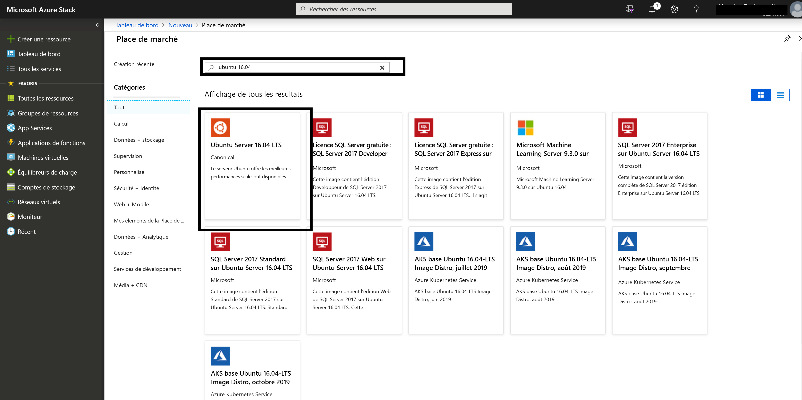
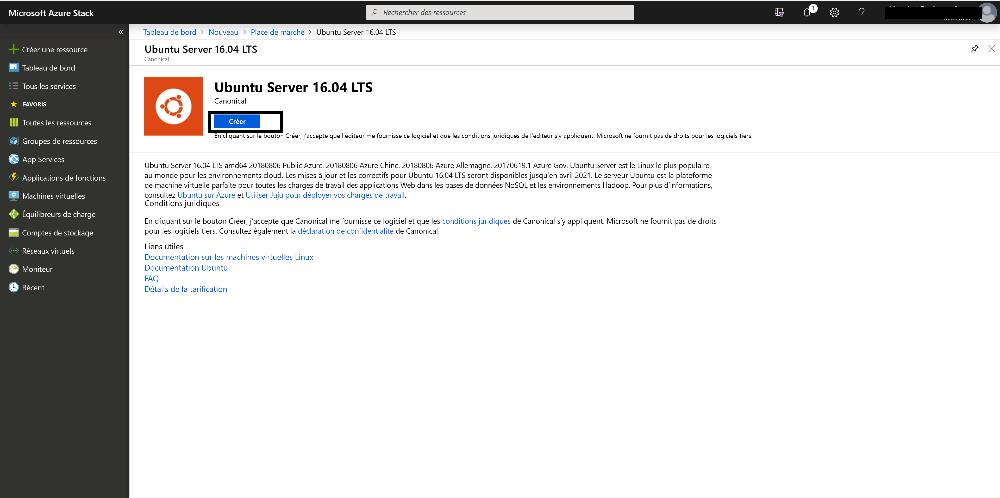
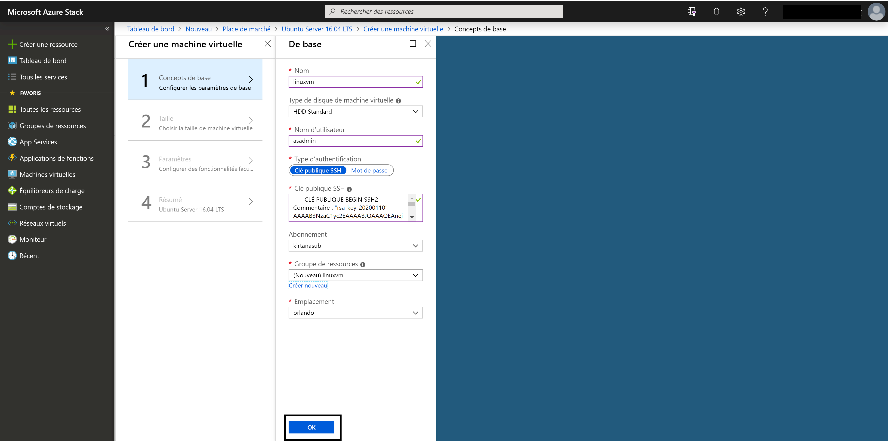
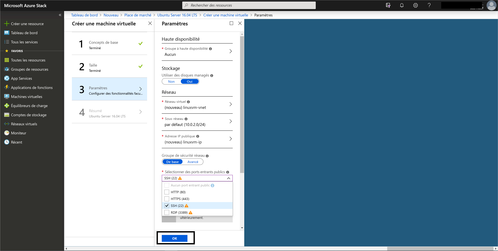
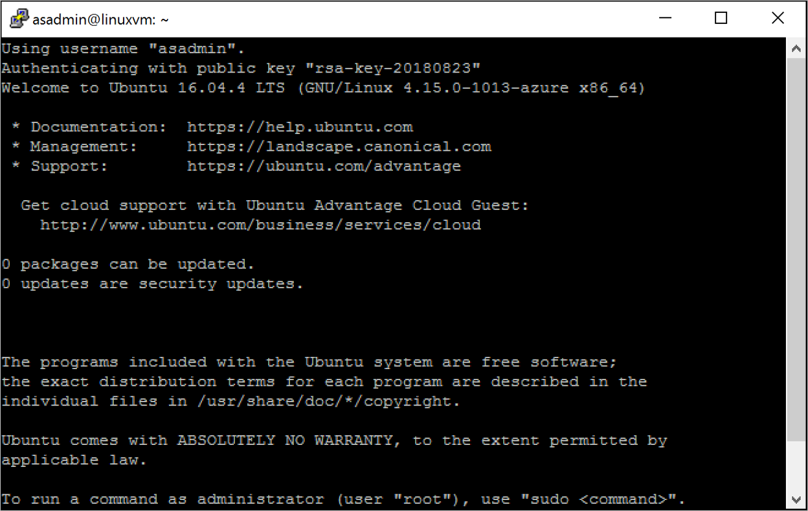

# <a name="quickstart-create-a-linux-server-vm-by-using-the-azure-stack-hub-portal"></a>Démarrage rapide : Créer une machine virtuelle serveur Linux sur le portail Azure Stack Hub

Vous pouvez créer une machine virtuelle Ubuntu Server 16.04 LTS à l’aide du portail Azure Stack Hub. Dans cet article, vous allez créer et utiliser une machine virtuelle. Cet article vous montre également comment :

* Se connecter à la machine virtuelle avec un client distant.
* Installer un serveur web NGINX.
* Nettoyer des ressources.

> [!NOTE]  
> Dans cet article, les images ont été mises à jour pour refléter les changements apportés à la version 1808 d’Azure Stack Hub. La version 1808 prend en charge les *disques managés*, en plus des disques non managés. Si vous utilisez une version antérieure, les images qui représentent certaines tâches, comme la sélection de disque, seront différentes de celles de votre interface utilisateur.  

## <a name="prerequisites"></a>Prérequis

* Une image Linux de la Place de marché Azure Stack Hub

   Par défaut, la Place de marché Azure Stack Hub ne propose pas d’image Linux. Demandez à l’opérateur Azure Stack Hub de vous fournir l’image Ubuntu Server 16.04 LTS dont vous avez besoin. L’opérateur peut utiliser les instructions fournies dans [Télécharger des éléments de la Place de marché à partir d’Azure dans Azure Stack Hub](../operator/azure-stack-download-azure-marketplace-item.md).

* Accès à un client SSH

   Si vous utilisez le Kit de développement Azure Stack (ASDK), vous n’aurez peut-être pas accès à un client SSH. Si vous avez besoin d’un client, sachez que plusieurs packages comprennent un client SSH. Par exemple, PuTTY comprend un client SSH et un générateur de clé SSH (puttygen.exe). Pour plus d’informations sur les packages disponibles, consultez [Guide pratique pour utiliser une clé publique SSH](azure-stack-dev-start-howto-ssh-public-key.md).

* Ce guide de démarrage rapide utilise PuTTY pour générer des clés SSH et établir une connexion à la machine virtuelle serveur Linux. [Téléchargez et installez PuTTY](https://www.putty.org).

## <a name="create-an-ssh-key-pair"></a>Création d’une paire de clés SSH

Pour terminer toutes les étapes de cet article, vous avez besoin d’une paire de clés SSH. Si vous disposez déjà d’une paire de clés SSH, vous pouvez ignorer cette étape.

Pour créer une paire de clés SSH :

1. Accédez au dossier d’installation PuTTY (l’emplacement par défaut est *C:\Program Files\PuTTY*), puis exécutez ce qui suit :

    `puttygen.exe`

1. Dans la fenêtre **PuTTY Key Generator**, choisissez **RSA** comme type de clé à générer (**Type of key to generate**) et **2048** comme nombre de bits dans une clé générée (**Number of bits in a generated key**).

   

1. Sélectionnez **Générer**.

1. Pour générer une clé, dans la zone **Key** (Clé), déplacez le pointeur de façon aléatoire.

1. Une fois la clé générée, sélectionnez **Save public key** (Enregistrer la clé publique), puis sélectionnez **Save private key** (Enregistrer la clé privée) pour enregistrer vos clés dans des fichiers.

   

## <a name="sign-in-to-the-azure-stack-hub-portal"></a>Connexion au portail Azure Stack Hub

L’adresse du portail Azure Stack Hub varie en fonction du produit Azure Stack Hub auquel vous vous connectez :

* Pour le kit ASDK, accédez à https://portal.local.azurestack.external.

* Pour un système intégré Azure Stack Hub, accédez à l’URL fournie par votre opérateur Azure Stack Hub.

## <a name="create-the-vm"></a>Création de la machine virtuelle

1. Sélectionnez **Créer une ressource** > **Calcul**. Recherchez `Ubuntu Server 16.04 LTS`. Sélectionnez le nom.

   

1. Sélectionnez **Create** (Créer).

   

1. Entrez les informations de la machine virtuelle. Sélectionnez **Clé publique SSH** comme type d’authentification, puis collez la clé publique SSH que vous avez enregistrée et sélectionnez **OK**.

    > [!Note]  
    > Veillez à supprimer tout espace blanc au début ou la fin de la clé.

   

1. Sélectionnez **D1_v2** comme taille de machine virtuelle.

   

1. Entrez vos modifications pour les valeurs par défaut dans le panneau **Paramètres**, Utiliser des disques managés. Si vous avez besoin d’autoriser l’accès SSH, sélectionnez **SSH (22)** pour ouvrir le port. Lorsque vos configurations sont prêtes, sélectionnez **OK**.

   

1. Sélectionnez **OK** dans la page Résumé pour démarrer le déploiement de la machine virtuelle. Pour voir votre nouvelle machine virtuelle, sélectionnez **Machines virtuelles**, recherchez le nom de la machine virtuelle, puis sélectionnez-la dans les résultats de la recherche.


## <a name="connect-to-the-vm"></a>Connexion à la machine virtuelle

1. Dans la page de la machine virtuelle, sélectionnez **Connecter**. Vous pouvez trouver la chaîne de connexion SSH dont vous avez besoin pour vous connecter à la machine virtuelle. 

1. Dans la page **PuTTY Configuration** (Configuration PuTTY), dans le volet **Category** (Catégorie), faites défiler jusqu’à **SSH**, puis développez-le et sélectionnez **Auth**. 

   

1. Sélectionnez **Browse** (Parcourir), puis sélectionnez le fichier de clé privée que vous avez enregistré.

1. Dans le volet **Category** (Catégorie), faites défiler jusqu’à **Session**, puis sélectionnez-la.

1. Dans la zone **Host Name (or IP address)** (Nom d’hôte (ou adresse IP)), collez la chaîne de connexion affichée dans le portail Azure Stack Hub. Dans cet exemple, il s’agit de la chaîne *asadmin@192.168.102.34* .

1. Sélectionnez **Open** afin d’ouvrir une session pour la machine virtuelle.

   

## <a name="install-the-nginx-web-server"></a>Installer le serveur web NGINX

Pour mettre à jour les sources de package et installer le dernier package NGINX sur la machine virtuelle, utilisez les commandes Bash suivantes :

```bash
#!/bin/bash

# update package source
sudo apt-get -y update

# install NGINX
sudo apt-get -y install nginx
```

Une fois que vous avez terminé l’installation de NGINX, fermez la session SSH et ouvrez la page **Vue d’ensemble** de la machine virtuelle dans le portail Azure Stack Hub.

## <a name="open-port-80-for-web-traffic"></a>Ouvrez le port 80 pour le trafic web

Un groupe de sécurité réseau (NSG) sécurise le trafic entrant et sortant. Quand une machine virtuelle est créée dans le portail Azure Stack Hub, une règle de trafic entrant est créée sur le port 22 pour les connexions SSH. Comme cette machine virtuelle héberge un serveur web, vous devez créer une règle NSG pour autoriser le trafic web sur le port 80.

1. Dans la page **Vue d’ensemble** de la machine virtuelle, sélectionnez le nom du **Groupe de ressources**.

1. Sélectionnez le **groupe de sécurité réseau** pour la machine virtuelle. Vous pouvez identifier le groupe de sécurité réseau à l’aide de la colonne **Type**.

1. Dans le volet de gauche, sous **Paramètres**, sélectionnez **Règles de sécurité de trafic entrant**.

1. Sélectionnez **Ajouter**.

1. Dans le champ **Nom**, tapez **http**. 

1. Vérifiez que l’option **Plage de ports** est définie sur 80 et l’option **Action** sur **Autoriser**.

1. Sélectionnez **OK**.

## <a name="view-the-welcome-to-nginx-page"></a>Afficher la page d’accueil de NGINX

Une fois NGINX installé et le port 80 ouvert sur votre machine virtuelle, vous pouvez accéder au serveur web à l’aide de l’adresse IP publique de la machine virtuelle. (L’adresse IP publique est affichée dans la page **Vue d’ensemble** de la machine virtuelle.)

Ouvrez un navigateur web et accédez à *http://\<adresse IP publique>* .


## <a name="clean-up-resources"></a>Nettoyer les ressources

Nettoyez les ressources dont vous n’avez plus besoin. Pour supprimer la machine virtuelle et ses ressources, sélectionnez le groupe de ressources dans la page de la machine virtuelle, puis sélectionnez **Supprimer**.

## <a name="next-steps"></a>Étapes suivantes

Dans ce guide de démarrage rapide, vous avez déployé une machine virtuelle serveur de base sous Linux avec un serveur web. Pour en savoir plus sur les machines virtuelles Azure Stack Hub, continuez avec [Considérations relatives aux machines virtuelles dans Azure Stack Hub](azure-stack-vm-considerations.md).
