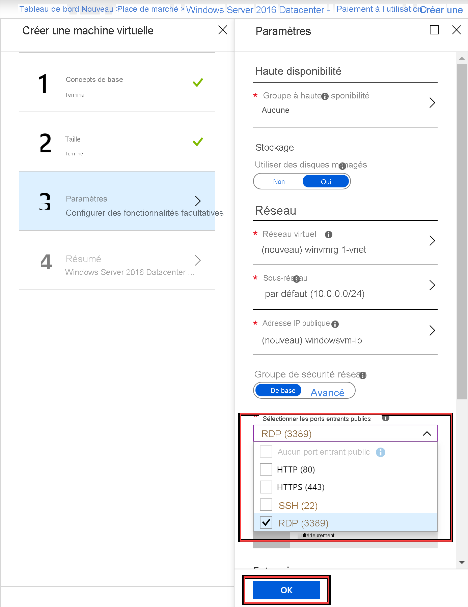

# Démarrage rapide : Créer une machine virtuelle Windows Server avec le portail Azure Stack Hub

Découvrez comment créer une machine virtuelle Windows Server 2016 avec le portail Azure Stack Hub.

> [!NOTE]  
> Les captures d’écran de cet article ont été mises à jour pour correspondre à l’interface utilisateur introduite avec Azure Stack Hub version 1808. Cette version ajoute la prise en charge de l’utilisation de *disques managés* à celle des disques non managés. Si vous utilisez une version antérieure, certaines images, par exemple la sélection des disques, sont différentes de celles qui sont affichées dans cet article.  

## Se connecter au portail Azure Stack Hub

Connectez-vous au portail Azure Stack Hub. L’adresse du portail Azure Stack Hub varie en fonction du produit Azure Stack Hub auquel vous vous connectez :

* Pour le Kit de développement Azure Stack (ASDK), accédez à : https://portal.local.azurestack.external.
* Pour un système intégré Azure Stack Hub, accédez à l’URL fournie par votre opérateur Azure Stack Hub.

## Créer une machine virtuelle

1. Sélectionnez **Créer une ressource** > **Calcul**. Recherchez ` Windows Server 2016 Datacenter – Pay as you use`.
    Si l’entrée **Windows Server 2016 Datacenter – Paiement à l’utilisation** n’apparaît pas, contactez votre opérateur cloud Azure Stack Hub et demandez-lui d’ajouter l’image à la Place de marché Azure Stack Hub. Pour obtenir des instructions, votre opérateur cloud peut se référer à [Créer et publier un élément personnalisé de Place de marché Azure Stack Hub](../operator/azure-stack-create-and-publish-marketplace-item.md).

    

1. Sélectionnez **Create** (Créer).

    

1. Tapez un **Nom**, un **Type de disque**, un **Nom d’utilisateur** et un **Mot de passe** sous **Paramètres de base**. Choisissez un **Abonnement**. Créez un **Groupe de ressources** ou sélectionnez un groupe existant, sélectionnez un **Emplacement**, puis sélectionnez **OK**.

    

1. Sélectionnez **D1_v2** sous **Taille**, puis choisissez **Sélectionner**.

    

1. Dans la page **Paramètres**, apportez les modifications souhaitées aux valeurs par défaut. Vous devez configurer les ports entrants publics souhaités à partir de la liste déroulante associée. Quand vous avez terminé, cliquez sur **OK**.

    

1. Sélectionnez **OK** sous **Résumé** pour créer la machine virtuelle.

    

1. Sélectionnez **Machines virtuelles** pour passer en revue votre nouvelle machine virtuelle. Recherchez le nom de la machine virtuelle, puis sélectionnez la machine virtuelle dans les résultats de la recherche.

## Nettoyer les ressources

Une fois que vous avez fini d’utiliser la machine virtuelle, supprimez-la ainsi que ses ressources. Pour ce faire, sélectionnez le groupe de ressources dans la page de la machine virtuelle, puis sélectionnez **Supprimer**.

## Étapes suivantes

Dans ce guide de démarrage rapide, vous avez déployé une machine virtuelle Windows Server de base. Pour en savoir plus sur les machines virtuelles Azure Stack Hub, continuez avec [Considérations relatives aux machines virtuelles dans Azure Stack Hub](azure-stack-vm-considerations.md).
