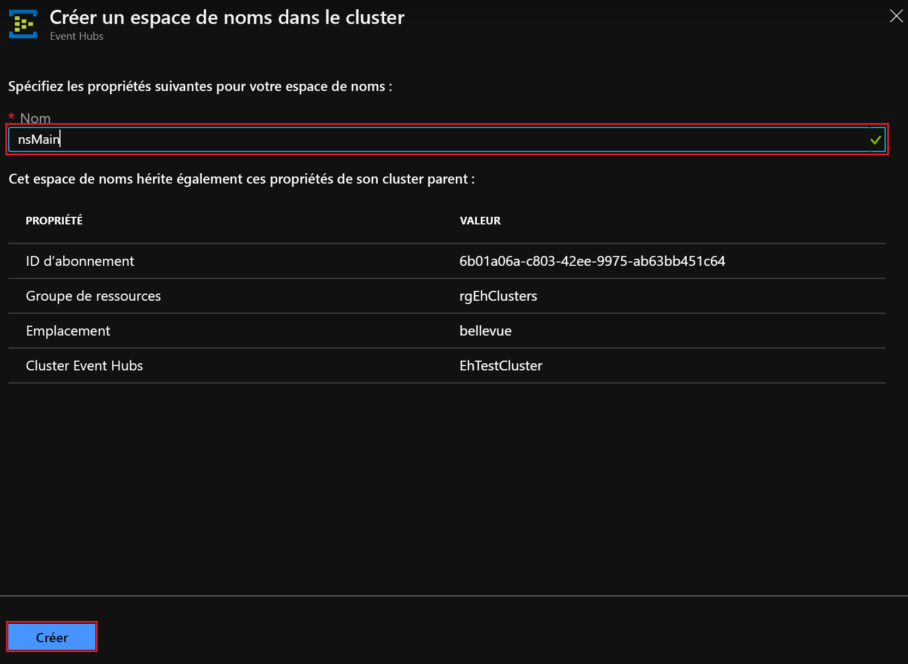

# Démarrage rapide : Créer un cluster Event Hubs à l’aide du portail Azure Stack Hub

[!INCLUDE [preview-banner](../includes/event-hubs-preview.md)]

Dans ce guide de démarrage rapide, vous allez apprendre à créer un cluster Event Hubs à l’aide du portail utilisateur Azure Stack Hub. 

Les clusters Event Hubs offrent des déploiements à locataire unique pour les besoins de streaming les plus pointus. Un cluster Event Hubs peut recevoir en entrée des millions d’événements par seconde avec une garantie de capacité et de latence inférieure à la seconde. Les clusters Event Hubs incluent toutes les fonctionnalités courantes et offrent une parité étroite avec celles de l’édition Azure Event Hubs.

## Prérequis

Avant de suivre ce guide de démarrage rapide, vérifiez que le service Event Hubs est disponible dans votre abonnement. Si ce n’est pas le cas, demandez à votre administrateur d’[installer Event Hubs sur le fournisseur de ressources Azure Stack Hub](../operator/event-hubs-rp-overview.md). Les étapes d’installation couvrent également la création d’une offre qui comprend le service Event Hubs. 

Une fois qu’une offre est disponible, votre administrateur peut créer ou mettre à jour votre abonnement pour inclure Event Hubs. Vous pouvez également [vous abonner à la nouvelle offre et créer votre propre abonnement](azure-stack-subscribe-services.md).

## Vue d’ensemble

Pour créer des clusters Event Hubs, vous spécifiez des unités de capacité (CU). Une CU est une quantité préallouée de ressources de processeur, de stockage et de mémoire. Les clusters Event Hubs sont facturés par processeur/heure. Le nombre de cœurs (processeurs) utilisés par un cluster est indiqué quand vous sélectionnez le nombre de CU (taille du cluster) au cours de l’expérience de création du cluster. Pour plus d’informations sur l’utilisation des ressources de cluster, consultez [Guide pratique pour planifier la capacité pour Event Hubs sur Azure Stack Hub](../operator/event-hubs-rp-capacity-planning.md). 

Dans ce guide de démarrage rapide, vous allez apprendre à utiliser le portail utilisateur Azure Stack Hub pour :
- Créer un cluster Event Hubs avec 1 CU
- Créer un espace de noms dans le cluster
- Créer un hub d’événements dans l’espace de noms
- Supprimer un cluster Event Hubs

## Créer un cluster Event Hubs

Un cluster Event Hubs fournit un conteneur d’étendue unique dans laquelle vous pouvez créer un ou plusieurs espaces de noms. Pour créer un cluster Event Hubs, effectuez les étapes suivantes : 

1. Connectez-vous au portail utilisateur Azure Stack Hub.
2. Sélectionnez  **Tous les services** dans le volet de navigation gauche, entrez « Clusters Event Hubs » dans la barre de recherche, puis sélectionnez l’élément **Clusters Event Hubs** dans la liste des résultats.
3. Une fois dans la page **Clusters Event Hubs**, sélectionnez **+ Ajouter** dans le menu supérieur. Le volet **Créer un cluster Event Hubs** s’ouvre à droite.
4. Sous l’onglet **De base** de la page  **Créer un cluster Event Hubs**  :  
   - **Nom de cluster** : Entrez un nom. Le système vérifie immédiatement si le nom est disponible. S’il est disponible, une coche apparaît à l’extrémité droite du champ. 
   - **Abonnement**: Sélectionnez l’abonnement dans lequel vous souhaitez créer le cluster. 
   - **Groupe de ressources** : Créez ou sélectionnez le groupe de ressources dans lequel vous souhaitez créer le cluster. 
   - Sélectionnez le bouton  **Suivant : Étiquettes >**  en bas de la page pour continuer. Vous devrez peut-être attendre que le système provisionne entièrement les ressources. 

   

5. Sous l’onglet  **Étiquettes** : 
   - Entrez éventuellement les paires nom/valeur pour la ou les étiquettes de ressource.  
   - Sélectionnez le bouton  **Suivant : Vérifier + créer >**   pour continuer. 

   

6. Sous l’onglet  **Vérifier + créer**, vous devez également voir la bannière « Validation réussie » en haut de la page. Passez en revue les détails, puis sélectionnez  **Créer** quand vous êtes prêt à créer le cluster. 

   

   >[!NOTE]
   > Le déploiement d’un cluster Event Hubs peut prendre du temps, au moins 45 minutes en général.

7. La page **Votre déploiement est en cours** indique l’état du déploiement. Une fois le déploiement terminé, la page indique **Votre déploiement a été effectué**. Avant de passer à la section suivante, sélectionnez le bouton **Accéder à la ressource** pour voir le nouveau cluster.

   

## Créer un espace de noms

Créez à présent un espace de noms dans votre nouveau cluster :

1. Dans la page **Vue d’ensemble** de **Cluster Event Hubs**, sélectionnez  **+ Espace de noms** dans le menu supérieur. 

   

2. Dans le volet **Créer un espace de noms dans le cluster** :

   - **Name** : Donnez un nom à l’espace de noms. Le système vérifie immédiatement si le nom est disponible. S’il est disponible, une coche apparaît à l’extrémité droite du champ. 
   - **Liste de propriétés/valeurs** : L’espace de noms hérite des propriétés suivantes : 
     - Identifiant d’abonnement 
     - Resource group 
     - Emplacement 
     - Nom du cluster 

   - Sélectionnez **Créer** pour créer l’espace de noms :

   

3. Notez votre nouvel espace de noms sous **Espaces de noms de cluster**. Avant de passer à la section suivante, sélectionnez le lien correspondant à votre nouvel espace de noms. 

   

## Créer un hub d’événements

1. Dans la page **Vue d’ensemble** d’**Espace de noms Event Hubs**, sélectionnez **Hub d’événements** dans le menu supérieur.  

   

2. Dans le volet **Créer un hub d’événements** :
   - **Name** : Donnez un nom au hub d’événements. Le noms ne peuvent contenir que des lettres, des chiffres, des points, des traits d’union et des traits de soulignement. Le nom doit commencer et se terminer par une lettre ou un chiffre. Le système vérifie immédiatement si le nom est disponible. S’il est disponible, une coche apparaît à l’extrémité droite du champ.
   - Sélectionnez **Créer** pour créer le hub d’événements.

   

## Supprimer un cluster Event Hubs

Pour supprimer le cluster :

1. Sélectionnez à nouveau **Tous les services** dans le volet de navigation gauche. Entrez « Clusters Event Hubs » dans la barre de recherche, puis sélectionnez l’élément **Clusters Event Hubs** dans la liste des résultats.
2. Dans la page **Clusters Event Hubs**, recherchez et sélectionnez le cluster que vous avez créé précédemment.

   

3. Dans la page **Vue d’ensemble** de **Cluster Event Hubs** :
   - Sélectionnez **Supprimer** dans le menu supérieur.  
   - Le volet **Supprimer le cluster** s’ouvre à droite, avec un message de confirmation de la suppression. 
   - Entrez le nom du cluster, puis sélectionnez **Supprimer** pour supprimer le cluster. 

   

## Étapes suivantes

Dans ce guide de démarrage rapide, vous avez appris à créer un cluster Event Hubs à l’aide du portail. Passez à présent aux guides de démarrage rapide « Envoyer et recevoir des événements », en commençant par le premier :  

> [!div class="nextstepaction"]
> [Envoyer des événements à Event Hubs ou en recevoir d’Event Hubs](/azure/event-hubs/get-started-dotnet-standard-send-v2)
